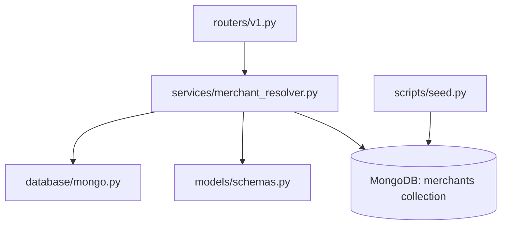
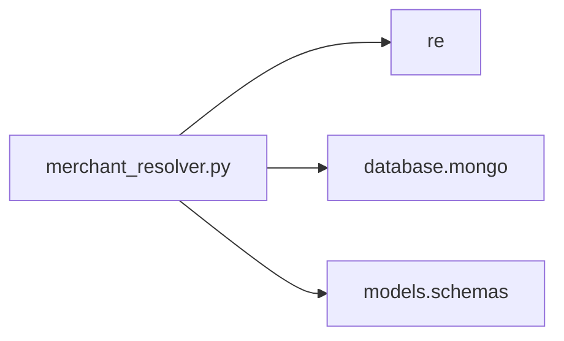
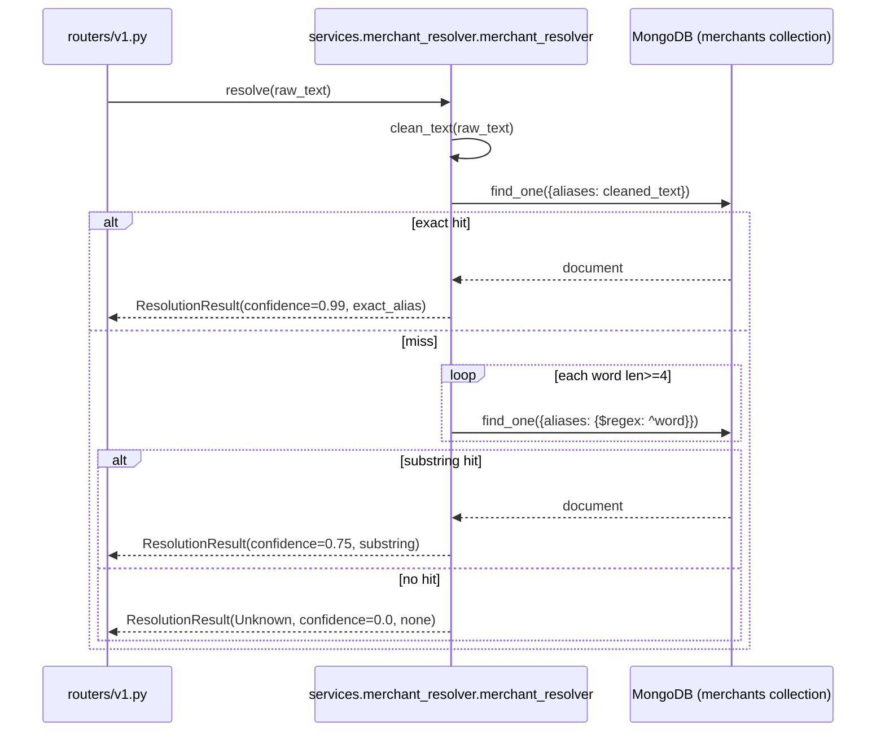

# Folder: `services/`

## Purpose
Home to `merchant_resolver.py`, the Phase 3 database-backed merchant-resolution service — the noise-tolerant counterpart to `engines/rule_engine.py` for messy bank/UPI transaction narrations.

## Responsibilities
- Clean noisy transaction text (strip UPI/IMPS/NEFT/RTGS/INB tokens, reference numbers, UPI handles, punctuation).
- Resolve cleaned text to a canonical merchant name via MongoDB lookups (exact alias match, then substring match).
- Report resolution confidence and method so callers can distinguish a certain match from a guess.

## Why this folder exists
This is a single-purpose "service" folder in the classic sense: it wraps a business capability (merchant identity resolution) that requires I/O (a database query) and therefore doesn't belong in the synchronous, in-memory `engines/` folder. As the codebase's own comments note, this is explicitly a placeholder for what Milvus-based semantic search (`milvus/`) is meant to eventually replace — the folder's existence marks a specific point in the system's evolution (Phase 3, pre-vector-search).

## How it interacts with other folders
`merchant_resolver.py` imports `database.mongo.db` (queries the `merchants` collection) and `models.schemas.ResolutionResult`. It is consumed by exactly one caller: `routers/v1.py`'s `POST /v1/resolve` endpoint. It has no relationship to `engines/rule_engine.py` despite solving an adjacent problem — the two never call each other or share the alias data source (`merchant_aliases.json` vs. the `merchants` Mongo collection, seeded separately by `scripts/seed.py`).

## Major files
| File | Role |
|---|---|
| `merchant_resolver.py` | `MerchantResolver` class, singleton `merchant_resolver` |

## Important classes
- **`MerchantResolver`** — constructs, at `__init__`, one combined noise-stripping regex (`noise_regex`) covering UPI/IMPS/NEFT/RTGS/INB tokens, 12-character alphanumeric reference numbers, and known UPI handle suffixes, plus a separate `special_chars_regex` for stripping remaining punctuation.

## Important functions
- **`clean_text(raw_text)`** — three-step normalization: strip noise tokens → strip special characters → collapse whitespace and uppercase. Deterministic and side-effect-free.
- **`resolve(raw_text)`** (async) — the three-tier resolution algorithm:
  1. Exact match: `merchants.find_one({"aliases": cleaned_text})` → confidence `0.99`, method `exact_alias`.
  2. Substring match: for each word ≥ 4 characters in the cleaned text, `merchants.find_one({"aliases": {"$regex": f"^{word}", "$options": "i"}})` → confidence `0.75`, method `substring`.
  3. Fallback: `canonical_merchant: "Unknown"`, confidence `0.0`, method `none`.

## Execution order
`merchant_resolver = MerchantResolver()` is instantiated at import time — cheap (just regex compilation), no I/O at startup, unlike `engines.rule_engine` which reads a file. All actual work (`resolve()`) happens per-request, asynchronously, against the live Mongo connection established by `database/mongo.py`'s `lifespan`-driven `connect()`.

## Dependency graph

## Call graph

## Potential interview questions
- "Why skip words shorter than 4 characters in the substring-matching loop?" (Avoids false positives on common corporate-suffix noise like `LTD`, `PVT`, `INC` matching unrelated merchants' aliases.)
- "This resolver issues one Mongo query per word in the worst case (no match found). What's the performance/scaling concern?" (Each `find_one` with a `$regex` prefix query on an unindexed `aliases` array field is a full collection scan; for N words and M merchants, worst case is O(N × M) work per resolve call — the code's own comment acknowledges Milvus/text-indexing should eventually replace this.)
- "Why does `resolve()` return confidence `0.99` rather than `1.0` for an exact match?" (Likely a deliberate hedge — leaves room to signal "this is as certain as this method gets" without claiming mathematical certainty; also keeps it below the `1.0` ceiling used elsewhere for calibrated confidence.)
- "How would you add fuzzy/typo-tolerant matching to this resolver without a full redesign?" (Tests whether the candidate would reach for Levenshtein distance, a trigram index, or push the work to Milvus semantic search per the code's own stated direction.)

## Common mistakes
- Assuming this resolver consults `merchant_aliases.json` — it only queries the `merchants` MongoDB collection, which must be separately seeded (`scripts/seed.py`) and is empty by default.
- Assuming `resolution_method` can be `"rule_engine"` (as documented in `models.schemas.ResolutionResult`'s field description) — this resolver never produces that value; only `exact_alias`, `substring`, `none`.
- Forgetting that `clean_text` uppercases everything — comparisons and stored aliases must be case-normalized consistently, or exact/substring matches will silently fail.
- Assuming the substring match step is ordered by best-match quality — it isn't; it returns the first word (in original left-to-right text order) that happens to prefix-match any alias, not necessarily the most specific or highest-confidence match available.

## Why this design is good
- The three-tier confidence ladder (exact → substring → unknown) gives callers an honest, gradated signal rather than a binary match/no-match — this composes well with the confidence-wall philosophy used elsewhere in the system.
- Isolating noise-stripping regex construction in `__init__` (rather than rebuilding it per call) keeps `clean_text` fast and the class's startup cost predictable and small.
- Explicitly treating this as a stopgap (per its own code comments) pointing toward the Milvus-based approach is honest engineering — it documents its own technical debt rather than pretending to be a final solution.

## If this folder disappeared
`routers/v1.py` would fail to import (`from services.merchant_resolver import merchant_resolver`), breaking the entire `/v1` router and `app.py` startup. `POST /v1/resolve` — one of the few genuinely working, well-formed endpoints in the system — would cease to exist, leaving no way to turn noisy UPI/bank narration strings into canonical merchant names short of the much stricter `engines/rule_engine.py` path.
