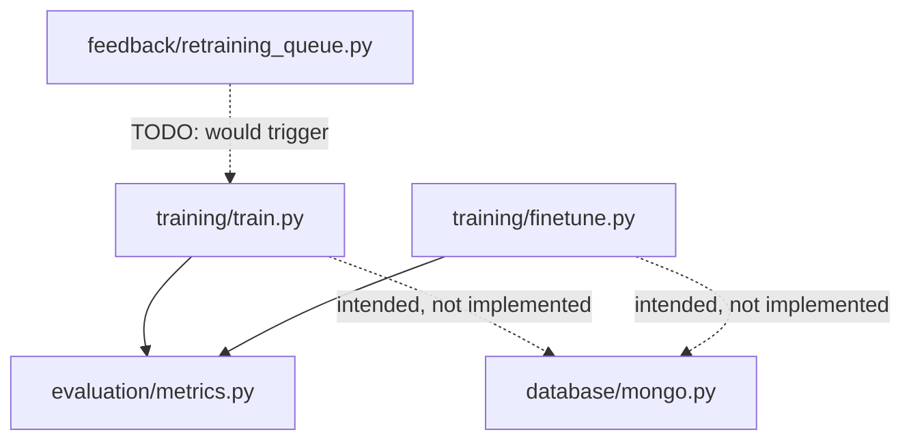
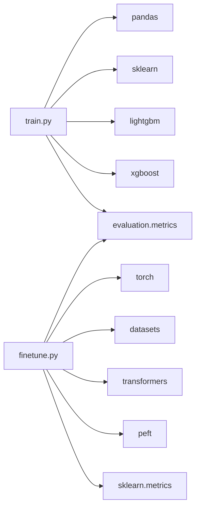
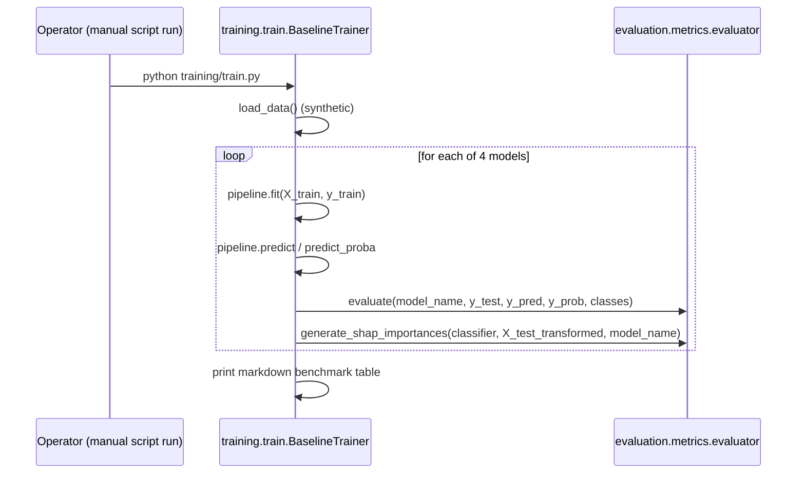

# Folder: `training/`

## Purpose
Offline, script-invoked ML pipelines: a classical-model benchmark suite (Phase 9) and a LoRA fine-tuning pipeline for a transformer-based classifier (Phase 11). Neither is reachable over HTTP.

## Responsibilities
- Train and compare four classical classifiers (Logistic Regression, Random Forest, LightGBM, XGBoost) on transaction-categorization features, reporting standard classification metrics and SHAP feature importances (`train.py`).
- Fine-tune a domain-pretrained BERT model (`ProsusAI/finbert`) using LoRA for parameter-efficient adaptation to transaction-categorization text, with calibration-aware evaluation (`finetune.py`).

## Why this folder exists
This folder represents the "should we build a real ML model, and if so, how good could it be" experimentation surface — deliberately separate from the always-on FastAPI service, since training runs are long-lived, resource-intensive, and not something you'd want triggered by an HTTP request without a proper job queue (which, per `feedback/retraining_queue.py`'s unfinished `TODO`, doesn't exist yet in this codebase).

## How it interacts with other folders
Both files depend on `evaluation/metrics.py` for shared metric computation (`ModelEvaluator`, ECE calculation). Both are **script entry points only** (`if __name__ == "__main__":`), invoked manually — nothing in `routers/`, `feedback/`, or anywhere else calls into `training/`. Both currently load **synthetic/mock data** rather than querying `database/mongo.py`, despite their own docstrings describing intended production data sources (`transactions`, `behavior_patterns`, `feedback`) — meaning, notably, `training/` has **zero actual dependency on `database/` today**, even though it conceptually should.

## Major files
| File | Role |
|---|---|
| `train.py` | `BaselineTrainer` — classical-model benchmark suite |
| `finetune.py` | `FinetuneEngine` — LoRA fine-tuning of `ProsusAI/finbert` |

## Important classes
- **`BaselineTrainer`** — holds `numeric_features`/`categorical_features` lists, a `ColumnTransformer` preprocessor, and a dict of four model instances (`LogisticRegression`, `RandomForestClassifier`, `LGBMClassifier`, `XGBClassifier`), each configured for class imbalance.
- **`FinetuneEngine`** — holds `base_model_id`, `output_dir`, and a loaded `AutoTokenizer`. Configures a `LoraConfig` (`r=8`, `alpha=16`, targeting `["query", "value"]` attention projections) and HuggingFace `TrainingArguments`.

## Important functions
- **`BaselineTrainer.load_data()`** — generates a 1000-row synthetic DataFrame (`np.random.exponential`/`randint`/`poisson`/`choice`); **not** a real Mongo query despite the docstring.
- **`BaselineTrainer.run_benchmarks()`** — full loop: preprocess → train/test split (stratified) → for each of 4 models: fit pipeline → predict/predict_proba → `evaluator.evaluate(...)` → `evaluator.generate_shap_importances(...)` → print a Markdown summary table.
- **`FinetuneEngine.load_training_data()`** — hardcoded 4-example mock dataset repeated 100x; tokenizes via the loaded tokenizer; **not** a real `db.feedback` query despite the docstring.
- **`FinetuneEngine.compute_metrics(p)`** — softmax → weighted F1, ROC AUC (with a `try/except ValueError` fallback for missing classes in a batch), and `evaluator.expected_calibration_error`.
- **`FinetuneEngine.train()`** — loads base model, wraps in PEFT/LoRA, configures `Trainer`, runs `trainer.train()`, saves the adapter (not the full model) to `{output_dir}/final_adapter`.

## Execution order
Each file is only executed top-to-bottom via `python training/train.py` or `python training/finetune.py`. Within `train.py::run_benchmarks`: preprocessing setup happens once, then the 4-model loop runs sequentially (not in parallel) — each iteration fully fits, predicts, evaluates, and SHAP-explains one model before moving to the next. Within `finetune.py::train`: data loading and tokenization happen once, then a single `Trainer.train()` call runs the full 3-epoch training loop, with `compute_metrics` invoked once per evaluation step as configured by `evaluation_strategy="epoch"`.

## Dependency graph

## Call graph

## Potential interview questions
- "Both `load_data()` and `load_training_data()` claim in their docstrings to query MongoDB but actually generate synthetic data. What's the risk of leaving this unaddressed?" (Anyone running these scripts assuming they train on real transaction/feedback data would get misleading benchmark numbers that don't reflect real-world class distributions or feature correlations — a false sense of model readiness.)
- "Why use LoRA rather than full fine-tuning for the transformer classifier?" (Dramatically fewer trainable parameters, lower memory/compute cost, and — per the code's own comment — a higher safe learning rate; appropriate for a domain-adaptation task on a moderately-sized pretrained model like FinBERT.)
- "Why target only `["query", "value"]` attention projections for LoRA rather than all linear layers?" (A common, well-validated LoRA configuration for BERT-style architectures that balances adaptation capacity against parameter/memory efficiency — targeting fewer modules keeps the adapter small.)
- "`XGBClassifier` is constructed with `use_label_encoder=False`. Why might this fail today?" (Newer XGBoost versions removed this parameter entirely; since dependencies aren't pinned anywhere in this repo, whether this raises depends on whatever version gets installed.)
- "How would you wire `training/train.py` to actually consume the retraining queue from `feedback/retraining_queue.py`?" (Replace `load_data()`'s synthetic generation with a query joining `db.feedback` corrections against `db.transactions`/`db.behavior_patterns`, and have `trigger_retraining_if_needed()` invoke `BaselineTrainer().run_benchmarks()` — currently marked as a `TODO`.)

## Common mistakes
- Assuming these scripts train on real production data — both use synthetic/mock data as committed.
- Running `training/finetune.py` without first installing `torch`, `transformers`, `peft`, `datasets` — none of these are in `requirements.txt`.
- Assuming `results_df.to_markdown()` in `train.py` will work without the optional `tabulate` package installed.
- Assuming a successful `BaselineTrainer` run automatically updates any model actually used by `engines/confidence_engine.py` or `routers/v1.py` — nothing in the live HTTP path consumes any output from this folder; there's no model-serving/loading step connecting the two.

## Why this design is good
- Benchmarking four architecturally different models (linear, bagged trees, two boosted-tree variants) side by side with the same evaluation harness is good practice for choosing a baseline before investing in fine-tuning a much heavier transformer model.
- Reusing `evaluation/metrics.py`'s `ModelEvaluator` (including ECE) across both the classical and transformer pipelines ensures apples-to-apples comparison between very different model families.
- Saving only the LoRA adapter (not the full fine-tuned model) keeps checkpoint artifacts small and makes it trivial to swap adapters against the same frozen base model later.

## If this folder disappeared
No impact on the running HTTP service whatsoever — nothing in `app.py`'s router graph imports anything from `training/`. The impact would be entirely on the ability to experiment with or produce a trained classification model at all; `evaluation/metrics.py` would lose both of its current callers (though it would remain importable and functional on its own, since nothing else calls it either).
